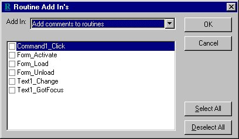



## Routines Add\-In

### Description

Source Code Routine Add In's

A Visual Basic add-in which provides 2 functions. Both functions scan the current code module and build a list of routine names. From this list you can select the routine on which the function is to be performed.

The first function will add comments at the beginning of the selected routines- including lines for parameters and return value descriptions.

The second function will add basic error checking to the selected routines. Note that for this function, the routine list will only include routines which do not already contain some type of error checking.

Various bug fixes made: 27/10/2000
 
### More Info
 

             |
---                |---
**Submitted On**   |2000-10-27 15:02:42
**By**             |[Nick Brice](https://github.com/Planet-Source-Code/PSCIndex/blob/master/ByAuthor/nick-brice.md)
**Level**          |Intermediate
**User Rating**    |4.0 (16 globes from 4 users)
**Compatibility**  |VB 6\.0
**Category**       |[VB function enhancement](https://github.com/Planet-Source-Code/PSCIndex/blob/master/ByCategory/vb-function-enhancement__1-25.md)
**World**          |[Visual Basic](https://github.com/Planet-Source-Code/PSCIndex/blob/master/ByWorld/visual-basic.md)
**Archive File**   |[CODE\_UPLOAD1098910272000\.zip](https://github.com/Planet-Source-Code/nick-brice-routines-add-in__1-12306/archive/master.zip)

